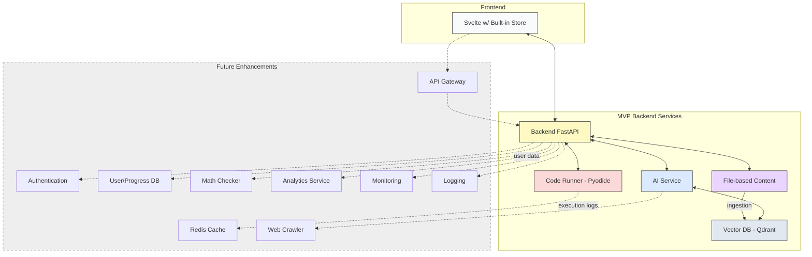

# Rabbitly
Your rabbit hole for learning ai

## System Diagram (Tentative)

```mermaid
flowchart TB
    %% Main MVP Components
    subgraph Edge["Frontend"]
        FE[Svelte w/ Built-in Store]
    end
    
    subgraph Core["MVP Backend Services"]
        API[Backend FastAPI]
        AI[AI Service]
        RUN[Code Runner - Pyodide]
        VDB[Vector DB - Qdrant]
        CONTENT[File-based Content]
    end
    
    subgraph Optional["Future Enhancements"]
        AUTH[Authentication]
        REDIS[Redis Cache]
        DB[User/Progress DB]
        WebCrawl[Web Crawler]
        MC[Math Checker]
        ANALYTICS[Analytics Service]
        MONITOR[Monitoring]
        LOGS[Logging]
        API_GATEWAY[API Gateway]
    end
    
    %% MVP communications
    FE <--> API
    
    %% Core service communications
    API <--> AI
    API <--> RUN
    
    %% Content flow
    CONTENT -->|ingestion| VDB
    AI <--> VDB
    API <--> CONTENT
    
    %% Optional/Future connections
    API -.-> AUTH
    API -.->|user data| DB
    AI -.-> WebCrawl
    API -.-> MC
    RUN -.->|execution logs| REDIS
    API -.-> ANALYTICS
    FE -.-> API_GATEWAY
    API_GATEWAY -.-> API
    API -.-> MONITOR
    API -.-> LOGS
    
    %% Styling
    style FE fill:#f8fafc,stroke:#333
    style API fill:#fef9c3,stroke:#333
    style AI fill:#dbeafe,stroke:#333
    style RUN fill:#fcd9d9,stroke:#333
    style CONTENT fill:#e9d5ff,stroke:#333
    style VDB fill:#e2e8f0,stroke:#333
    
    classDef optional fill:#eee,stroke:#999,stroke-dasharray:5 5
    class Optional optional
```